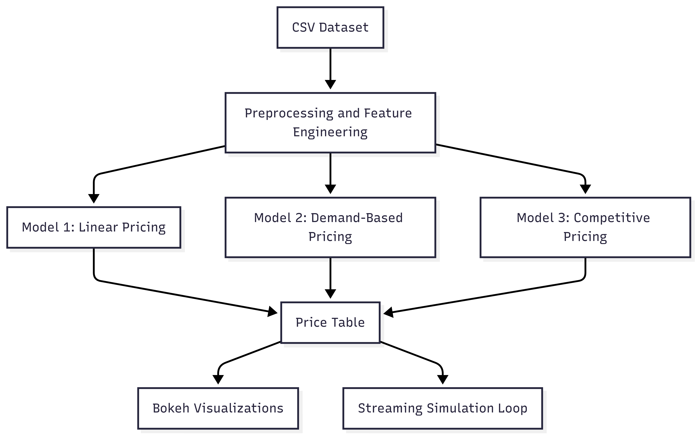

# Analytics_Project
# Dynamic Pricing for Urban Parking Lots

This project implements a dynamic pricing system for urban parking lots using real-time data and demand modeling. The goal is to optimize pricing based on changing demand patterns, vehicle types, traffic conditions, and competition from nearby lots.

---

## Project Overview

Static pricing for urban parking often leads to inefficiencies such as overcrowding or underutilization. To solve this, we developed a dynamic pricing engine for 14 parking spaces over 73 days, with 18 daily time intervals.

The project consists of three models:

1. **Model 1: Linear Pricing Model**  
   Adjusts price based on occupancy rate using a simple linear function.

2. **Model 2: Demand-Based Pricing Model**  
   Factors in occupancy, queue length, traffic congestion, special events, and vehicle type to compute a normalized demand score.

3. **Model 3: Competitive Pricing Model**  
   Incorporates location-based competition by adjusting prices depending on nearby parking lot pricing and availability.

---

## Tech Stack Used

| Component              | Tool / Library         |
|------------------------|------------------------|
| Programming Language   | Python                 |
| Data Manipulation      | Pandas, NumPy          |
| Visualization          | Bokeh                  |
| Simulation Logic       | Pathway (mocked with Pandas) |
| Distance Calculation   | Haversine formula      |
| Environment            | Google Colab / Jupyter Notebook |
| Version Control        | Git, GitHub            |

---

## Architecture Diagram

---

## Project Architecture and Workflow

### 1. Data Preprocessing
- Parsed `LastUpdatedDate` and `LastUpdatedTime` into a single datetime column.
- Created new features such as `OccupancyRatio` and encoded categorical fields (`VehicleType`, `TrafficConditionNearby`).
- VehicleType weights: `bike = 0.5`, `car = 1.0`, `truck = 1.5`.
- Traffic levels encoded as: `low = 0`, `medium = 1`, `high = 2`.

### 2. Model 1: Baseline Linear Model
- Pricing formula:  
  `Price_t+1 = Price_t + α × (Occupancy / Capacity)`
- Smooth, cumulative price increases as occupancy grows.
- Simple reference model to benchmark more complex pricing.

### 3. Model 2: Demand-Based Pricing
- Demand is calculated as:  
  `Demand = α × (OccupancyRatio) + β × QueueLength - γ × TrafficLevel + δ × IsSpecialDay + ε × VehicleWeight`
- Normalized using Min-Max scaling to [0, 1].
- Final price:  
  `Price = Base × (1 + λ × NormalizedDemand)`
- Prices clamped between 0.5× and 2× base price for stability.

### 4. Model 3: Competitive Pricing
- Used haversine distance to find nearby lots within 1 km.
- Adjusted price based on nearby lot behavior:
  - If current lot is ≥90% full and neighbors are cheaper → price reduced by 10%.
  - If neighbors are more expensive → price increased by 10%.
- Prices clamped within [0.5x, 2x] bounds.

### 5. Visualization and Streaming Simulation
- Plotted real-time price variations using Bokeh.
- Simulated data streaming using timestamp-based loop (mocked version of Pathway).
- Output includes visual justification of pricing behavior for each lot and model.

---

## Repository Contents

| File | Description |
|------|-------------|
| `notebook.ipynb` | Complete implementation with model code and plots |
| `README.md` | This project overview and documentation |
| `dataset.csv` | Input dataset|
| `architecture.png` | Exported architecture diagram image |
